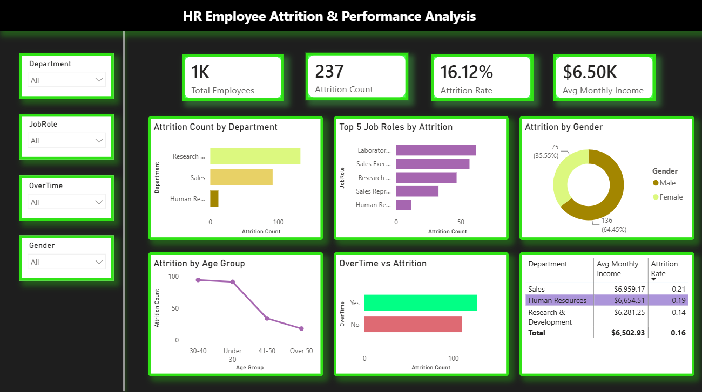

# HR Employee Attrition & Performance Analysis

## Project Overview

This project analyzes employee attrition using the IBM HR Analytics Employee Attrition dataset. The objective is to identify the major factors influencing employee turnover and present meaningful business insights through SQL, Python, and Power BI.

The project demonstrates an end-to-end data analytics workflow including data querying, exploratory data analysis (EDA), data visualization, and interactive dashboard development.

---

## Dataset

- **Dataset:** IBM HR Analytics Employee Attrition
- **Source:** Kaggle
- **Records:** 1,470 Employees
- **Features:** 35 Columns

---

## Tools & Technologies

- MySQL Workbench
- SQL
- Python
- Pandas
- Matplotlib
- Google Colab
- Power BI Desktop
- GitHub

---

## Project Workflow

### Phase 1 – SQL Analysis

Performed SQL analysis to answer business questions such as:

- Overall employee attrition rate
- Department-wise attrition
- Job role salary analysis
- Attrition by gender
- Attrition by overtime
- Job satisfaction analysis
- Performance rating analysis
- Education field attrition
- Age group analysis
- Highest paid department

**Deliverable**

- `SQL/HR_Analysis_Queries.sql`

---

### Phase 2 – Python Exploratory Data Analysis

Performed exploratory data analysis using Python.

Tasks completed:

- Data loading
- Data exploration
- Missing value analysis
- Employee attrition analysis
- Data visualization

Visualizations created:

- Overall Attrition
- Attrition by Department
- Age Distribution
- Monthly Income vs Attrition
- OverTime vs Attrition
- Job Satisfaction vs Attrition

**Deliverable**

- `Python/HR_Attrition_EDA.ipynb`

---

### Phase 3 – Power BI Dashboard

Built an interactive dashboard containing:

### KPI Cards

- Total Employees
- Attrition Count
- Attrition Rate
- Average Monthly Income

### Visualizations

- Attrition by Department
- Top 5 Job Roles by Attrition
- Attrition by Gender
- Attrition by Age Group
- OverTime vs Attrition
- Job Satisfaction vs Attrition
- Department-wise Summary Table

### Interactive Filters

- Department
- Gender
- Job Role
- OverTime

**Deliverables**

- `PowerBI/HR_Employee_Attrition_&_Performance_Analysis.pbix`
- `PowerBI/HR_Employee_Attrition_&_Performance_Analysis.pdf`
- `PowerBI/HR_Employee_Attrition_&_Performance_Analysis.png`

---

## Key Business Insights

- Overall employee attrition rate is approximately **16%**.
- Sales department experiences the highest employee attrition.
- Employees working overtime are more likely to leave.
- Employees with lower monthly income show higher attrition.
- Lower job satisfaction is associated with increased employee turnover.
- Most employees who left belong to younger age groups.

---

## Learning Outcomes

Through this project, I gained practical experience in:

- Writing SQL queries for business analysis
- Performing exploratory data analysis using Python
- Creating data visualizations with Matplotlib
- Building interactive dashboards in Power BI
- Identifying business insights from HR data
- Organizing a complete analytics project using GitHub

---

## Author

**Supriya N**
